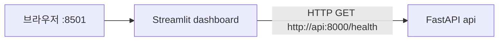

# 개발 상태와 CI/CD

## 현재 범위



- Python 3.12를 사용한다. 학교의 필수 기준은 Python 3.10 이상이며,
  권장 구현 순서에 등장하는 3.10은 고정 버전 요구가 아니다.
- `/health`만 구현했다. Pydantic 응답 스키마와 Swagger UI를 제공한다.
  `status: ok`는 HTTP 서버 동작을 뜻하고 투자 추론 준비 상태를 의미하지 않는다.
  모델 로더가 없으므로 `model_loaded`는 항상 `false`다.
- Streamlit은 HTTP 응답만 표시한다. backend 코드나 모델 파일을 읽지 않는다.
- Dockerfile의 `api`, `dashboard` 빌드 대상을 분리하고 각 서비스의 의존성만 설치한다.
  직접 사용하는 의존성 버전은 각 `requirements.txt`에 고정했다.
  전이 의존성 전체를 잠그는 lock 파일은 아직 없다.
- 기본 Compose 서비스는 두 개뿐이다. 수집·학습·전체 백테스트 실행 코드는 없으며,
  서버 시작·API 요청 시 자동 실행되지 않는다. 향후 별도 명령/작업으로 구현한다.
- `.dockerignore`는 현재 실행에 필요한 파일만 허용한다. 새 런타임 모듈을 추가할 때
  Dockerfile의 `COPY`와 `.dockerignore`를 함께 갱신해야 한다.
  데이터·모델 볼륨과 외부 LLM API 키는 현재 필요하지 않다.

## 학교 요구사항 중 미구현

- API: `POST /optimize`, `POST /explain`, `POST /research`, `GET /backtest`.
  등록하지 않았으므로 404를 반환한다.
- 대시보드 6개 페이지: 포트폴리오 현황, 강화학습 성과, SHAP 해석,
  에이전트 리서치, ANOVA 결과, 리스크 모니터링.
- 10개 이상 자산의 5년 이상 데이터 수집, 전처리, 기술적 지표.
- Gymnasium 환경, 거래비용, 보상 함수 3종, PPO 학습, Safe-Guard.
- Walk-Forward 백테스트, 12개 성과 지표, MVO·벤치마크 비교.
- SHAP, ANOVA·사후 검정, LangGraph/RAG·출처·위험 태그 연동.
- 모델 로딩과 추론 시간·투자 성과 기준 검증.
- 보상 함수 설계 근거, 성능·ANOVA 요약, 에러 분석 및 20페이지 이상 실험 리포트.

현재 테스트는 실행 기반을 검증한다. 금융·모델 기능의 테스트는 해당 구현 이후에
추가해야 한다. 학교 최종 제출물 전체가 완성된 상태가 아니다.
권장 다음 순서는 데이터 수집·전처리 → 거래 환경·학습 → 백테스트·해석·리서치
→ API·대시보드 통합이다. MLflow, 주기적 수집·재학습, 이상거래 탐지,
멀티모달, 공정성 분석은 학교의 선택 과제다.

## PR CI

`.github/workflows/ci.yml`은 PR 생성, 추가 push(`synchronize`), 재오픈,
리뷰 준비 전환 시 실행된다. 저장소 읽기 권한만 사용하며 secrets가 필요 없다.

| 상태 검사 이름 | 실행 내용 |
| --- | --- |
| `quality` | Python 3.12 의존성 설치·호환성 확인, Black, flake8, pytest |
| `docker-smoke` | 두 이미지 빌드, Compose healthcheck 대기, 공개 HTTP 포트, dashboard 내부에서 실제 API 호출·화면 렌더링·새로고침 |

```bash
python -m pip install -r requirements-dev.txt
python -m pip check
python -m black --check backend frontend tests scripts
python -m flake8 backend frontend tests scripts
python -m pytest -q
```

단위 테스트는 FastAPI TestClient와 모의 HTTP 응답을 사용한다.
`scripts/smoke.py`는 Compose dashboard 컨테이너 안에서 실제 API를 호출하고
Streamlit AppTest로 페이지를 실행한다. 브라우저 자동화 검사는 아니다.
CI에서 데이터 수집, 재학습, 전체 백테스트, 외부 LLM 호출은 하지 않는다.
패키지·베이스 이미지 다운로드에는 인터넷 연결이 필요하다.

GitHub에서 첫 PR의 CI 실행 후 기본 브랜치의 Settings → Rules → Rulesets
(또는 Branches → Branch protection)에 PR 필수 규칙과 필수 상태 검사
`quality`, `docker-smoke`를 지정한다. 상태 검사 목록에서는 `CI` 워크플로의
해당 이름을 선택한다. 워크플로 파일만 추가해도 병합 차단 규칙이 자동 설정되지는 않는다.
기존 Issue 브랜치 워크플로와 Issue/PR 템플릿은 유지한다.

## 로컬 검증 결과 (2026-10-02)

- `python -m pip check`, Black 검사, flake8 통과.
- `python -m pytest -q`: 18개 케이스 통과(테스트 함수 10개, 매개변수 사례 포함).
  Starlette TestClient의 httpx 사용에 대한 폐기 예정 경고 1건이 있다.
  실제 금융·모델 기능 검증을 대신하는 테스트가 아니다.
- `docker compose config --quiet`, `docker compose build` 통과.
- `docker compose up --build -d --wait --wait-timeout 120`: 두 서비스 healthy.
- 호스트의 `/health`: HTTP 200, `{"status":"ok","model_loaded":false}`.
  Streamlit `/_stcore/health`: HTTP 200, `ok`.
- dashboard 컨테이너 안에서 `scripts/smoke.py` 실행 통과:
  실제 `api` 서비스 HTTP 호출, 모델 미로드 표시, 화면 새로고침 확인.
  PowerShell에서는 UTF-8로 스크립트를 표준입력으로 전달했다.
- 두 컨테이너의 `python -m pip check` 통과. `/app`에는 각 서비스의 소스와
  requirements 파일만 있으며 `.env`, 데이터, 모델 파일이 없음을 확인했다.
- Git 제외 규칙 확인: `.env`, `.env.local`, 실제 데이터 경로, 모델 파일,
  Streamlit secrets, credentials는 제외된다. `.env.example`과 `.gitkeep`은 유지한다.
- 첫 로컬 pytest 시도는 패키지 설치가 완료되기 전에 실행해 수집에 실패했다.
  설치 완료 후 위 검사 전체를 다시 실행해 통과했다.
- `docker compose down` 성공. 검증용 컨테이너와 프로젝트 네트워크를 종료·제거했다.
- CI YAML 구조를 확인했다. GitHub 호스팅 runner의 실제 PR 워크플로 실행은
  아직 미확인이다. 커밋·push 없이 로컬 코드와 Docker 실행을 검증했다.

## 로컬 검증 결과 (2026-10-02)

- `python -m pip check`, Black 검사, flake8 통과.
- `python -m pytest -q`: 18개 케이스 통과(테스트 함수 10개, 매개변수 사례 포함).
  Starlette TestClient의 httpx 사용에 대한 폐기 예정 경고 1건이 있다.
  실제 금융·모델 기능 검증을 대신하는 테스트가 아니다.
- `docker compose config --quiet`, `docker compose build` 통과.
- `docker compose up --build -d --wait --wait-timeout 120`: 두 서비스 healthy.
- 호스트의 `/health`: HTTP 200, `{"status":"ok","model_loaded":false}`.
  Streamlit `/_stcore/health`: HTTP 200, `ok`.
- dashboard 컨테이너 안에서 `scripts/smoke.py` 실행 통과:
  실제 `api` 서비스 HTTP 호출, 모델 미로드 표시, 화면 새로고침 확인.
  PowerShell에서는 UTF-8로 스크립트를 표준입력으로 전달했다.
- 두 컨테이너의 `python -m pip check` 통과. `/app`에는 각 서비스의 소스와
  requirements 파일만 있으며 `.env`, 데이터, 모델 파일이 없음을 확인했다.
- Git 제외 규칙 확인: `.env`, `.env.local`, 실제 데이터 경로, 모델 파일,
  Streamlit secrets, credentials는 제외된다. `.env.example`과 `.gitkeep`은 유지한다.
- 첫 로컬 pytest 시도는 패키지 설치가 완료되기 전에 실행해 수집에 실패했다.
  설치 완료 후 위 검사 전체를 다시 실행해 통과했다.
- `docker compose down` 성공. 검증용 컨테이너와 프로젝트 네트워크를 종료·제거했다.
- CI YAML 구조를 확인했다. GitHub 호스팅 runner의 실제 PR 워크플로 실행은
  아직 미확인이다. 커밋·push 없이 로컬 코드와 Docker 실행을 검증했다.

## CD에서 결정할 사항

자동 배포는 구현하지 않는다. 먼저 아래 내용을 결정해야 한다.

- 배포 서버·운영체제·도메인·TLS 및 외부 공개 포트.
- 이미지 레지스트리, 이미지 태그 정책, 인증 수단.
- 배포 대상 브랜치·승인 정책·배포 계정 권한.
- 운영 비밀정보, 데이터·모델 보관 위치와 읽기 권한, 별도 배치 작업 실행 방식.
- 배포 후 healthcheck, 로그·모니터링, 실패 시 롤백 기준.

본 시스템은 교육 목적으로 개발되며 실제 투자 조언에 사용할 수 없습니다.
백테스팅 성과는 미래 수익을 보장하지 않습니다.
